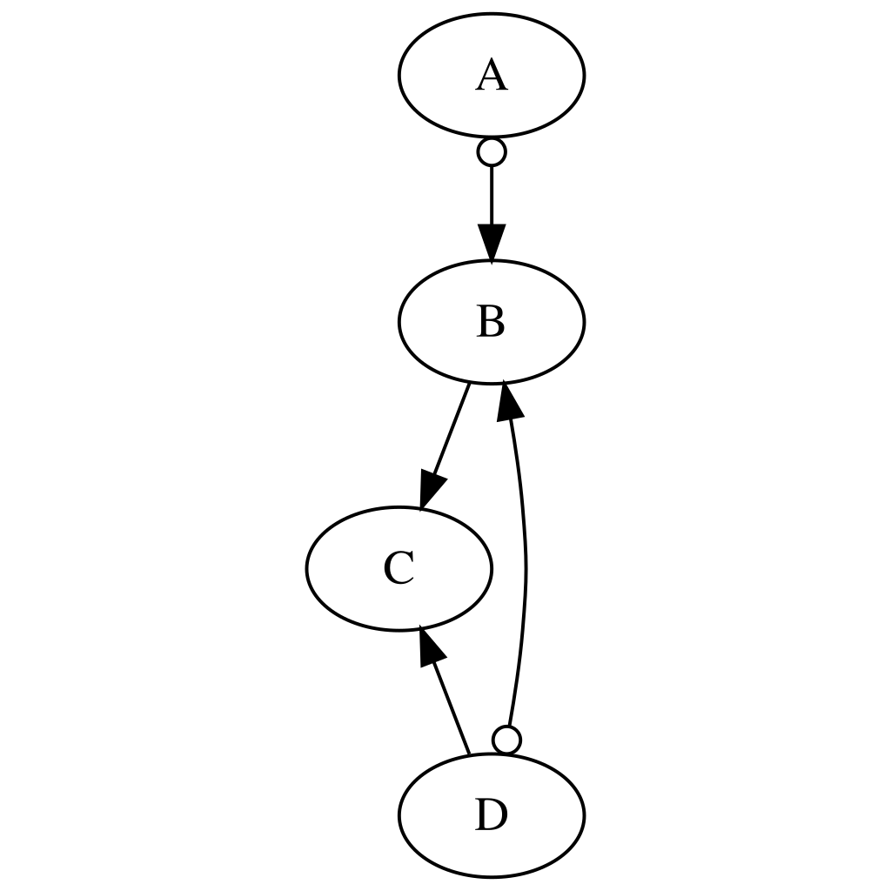

## Setup

#### Installing required R packages

```{r, include = TRUE, eval = FALSE}
install.packages("BiocManager")
BiocManager::install(c("graph", "RBGL", "Rgraphviz"))
install.packages(c("igraph", "pcalg", "dagitty", "causaleffect"), dependencies=TRUE)
install.packages("devtools")
devtools::install_github("adele/PAGId", dependencies=TRUE)
```

#### Loading libraries

```{r setup, include = TRUE, results='hide', warning=FALSE}
source("utils/utils.R")
library(pcalg, warn.conflicts=F, quietly=T)
library(dagitty, warn.conflicts=F, quietly=T)
library(MASS, warn.conflicts=F, quietly=T)
library(causaleffect, warn.conflicts=F, quietly=T)
library(igraph, warn.conflicts=F, quietly=T)
library(PAGId, warn.conflicts=F, quietly=T)
```

## Part I: Causal Modeling and Effect Identification from Causal Diagrams

### Model Definition

#### Structural Causal Model

The SCM will be only used later for generating a dataset.

```{r, echo = TRUE}
trueSCM <- getIVSEM()
```

#### Causal Diagram

Plotting the graph corresponding to the SCM.

```{r, echo = TRUE, warning=FALSE}
trueDAG_obj <- getIVGraph()
trueDAG <- trueDAG_obj$amat.dagitty # adjacency matrix as a dagitty object
trueDiagram <- trueDAG_obj$amat.igraph # adjacency matrix as an igraph object
plot(trueDAG) # showing the U variables
plot(trueDiagram) # bidirected edges represent hidden confounders
```

### Effect Identification from the Causal Diagram

#### Identification via Adjustment

Checking identifiability of P(y\|do(x)) through generalized adjustment criterion (GAC).

```{r, include = TRUE, warning=FALSE}

x = 2 # index of variable "B"
y = 3 # index of variable "C"

trueMAG <- dagitty::toMAG(trueDAG) # graphical model without the latent confounders 
                                   # we will see this later

trueMAG.pcalg <- dagitty2amat(trueMAG, type="mag")
labels <- colnames(trueMAG.pcalg)

adj <- pcalg::adjustment(amat = trueMAG.pcalg, amat.type = "mag",
                  x = x, y = y, set.type = "all")
if (length(adj) > 1) {
  print(paste0("P(", y, "|do(", x, ")) is identifiable via adjustment over:"))
  sapply(adj, function(x) { paste(labels[x], collapse=",") } ) # List of all sets admissible for adjustment
} else {
  print(paste0("P(", y, "|do(", x, ")) is not identifiable via adjustment."))
}

```

Checking whether a particular set is admissible for adjustment.

```{r, include = TRUE, warning=FALSE}
z <- c(1) # indices of the covariate set
zlabels <- labels[z]
gac_out <- pcalg::gac(trueMAG.pcalg, x, y, z, type = "mag")
is_admissible <- gac_out$gac

print(paste0("Is set {", paste(zlabels, collapse=","), "} admissible for adjustment? ", is_admissible))
```

#### Identification via ID Algorithm from a Causal Diagram

##### Marginal Causal Effect

```{r, echo = TRUE, warning=FALSE}
y = "B"
x = "C"
z = c()
exprDAG <- causaleffect::causal.effect(y=y, x=x, z=z,
                                       G = trueDiagram,
                                       expr = TRUE,
                                       simp = TRUE,
                                       steps = FALSE)
print(paste0("P(", y, "|do(", x, ")) = ", exprDAG))

# Note: to see all steps applied by the ID algorithm,
# use expr = FALSE and steps = TRUE.

##### Conditional Causal Effect 

y = "C"
x = "B"
z = c("D")
exprDAG <- causaleffect::causal.effect(y=y, x=x, z=z,
                                       G = trueDiagram,
                                       expr = TRUE,
                                       simp = TRUE,
                                       steps = FALSE)
print(paste0("P(", y, "|do(", x, "), ", z, ") = ", exprDAG))
```

### Questions:

1. Is the causal effect of D on C identifiable from the causal diagram? If so, how?
2. What can we do if no knowledge is available to construct a causal diagram? 


## Part II: Causal Discovery and Effect Identification from the Markov Equivalence Class

### Markov Equivalence Class:

#### Maximal Ancestral Graph (MAG)

Computing the MAG corresponding to the true causal diagram.

```{r, echo = TRUE, warning=FALSE}
trueMAG <- dagitty::toMAG(trueDAG)
plot(trueMAG)
```

#### Implied Minimal Conditional Independencies

The conditional independencies (among observed variables) implied by a MAG through m-separations are the same as the conditional independencies (among the observed variables) implied from a causal diagram through d-separations.

Notably, MAGs preserve conditional independencies without explicitly encoding latent confounders.

```{r, echo = TRUE, warning=FALSE}
trueImpliedCI <- dagitty::impliedConditionalIndependencies(trueMAG, type = "missing.edge")
trueImpliedCI
```

#### Partial Ancestral Graph (PAG)

The true PAG can be obtained by running the FCI with an oracle (i.e., conditional independencies are directly inferred from the true DAG using d-separation).

```{r, echo = TRUE, warning=FALSE}
truePAG <- getTruePAG(trueDAG, verbose = TRUE)
```

```{r, include = FALSE, warning=FALSE}
renderAG(truePAG@amat, fileid = "truePAG", add_index = FALSE)
```

{#id .class width="40%" height="50%"}

### Causal Discovery

#### Data Generation from the True SCM

We are generating n=10000 samples.

```{r, echo = TRUE, warning=FALSE}
n = 10000  # sample size
dat <- generateDatasetFromSEM(trueSCM$beta, trueSCM$lat, n)
dat <- dat[, c("A", "B", "C", "D")] # selecting only V={A, B, C, D}
head(dat)
```

#### Inferring the PAG using FCI Algorithm

Since our variables follow a Gaussian distribution, the partial correlation test (Fisher's Z test) can be used to assess conditional independencies.

For other data types, appropriate conditional independence tests should be used.

```{r, echo = TRUE, warning=FALSE}
indepTest <- pcalg::gaussCItest    # Fisher's Z test
alpha <- 0.05                      # Significance level of 5%
suffStat <- list(C = cor(dat), n = n)
estPAG <- pcalg::fci(suffStat,
                     indepTest = indepTest,
                     labels= colnames(dat), alpha = alpha,
                     verbose = TRUE)
```

```{r, include = FALSE, warning=FALSE}
renderAG(estPAG@amat, fileid = "estimatedPAG", add_index = FALSE)
```

{#id .class width="40%" height="50%"}

### Questions:

1.  Did we recover the correct PAG?
2.  What the inferred PAG tell us about the relationship between every pair of nodes?
3.  Is the true causal diagram a member of the PAG's Markov Equivalence Class?
4.  What can it happen with a smaller sample size?

### Effect Identification from the Markov Equivalence Class

#### Effect Identification via Generalized Adjustment Criterion (GAC)

Checking identifiability of P(y\|do(x)) through generalized adjustment criterion (GAC).

```{r, include = TRUE, warning=FALSE}

labels <- colnames(estPAG@amat)
x = 2 # index of variable "B"
y = 3 # index of variable "C"

adj <- adjustment(amat = estPAG@amat, amat.type = "pag",
                  x = x, y = y, set.type = "all")

if (length(adj) > 1) {
  print(paste0("P(", y, "|do(", x, ")) is identifiable via adjustment over:"))
  sapply(adj, function(x) { paste(labels[x], collapse=",") } ) # List of all sets admissible for adjustment
} else {
  print(paste0("P(", y, "|do(", x, ")) is not identifiable via adjustment."))
}

```

Checking whether a particular set is admissible for adjustment.

```{r, include = TRUE, warning=FALSE}
z <- c(1) # indices of the covariate set
zlabels <- labels[z]
gac_out <- gac(estPAG@amat, x, y, z, type = "pag")
is_admissible <- gac_out$gac

print(paste0("Is set {", paste(zlabels, collapse=","), "} admissible for adjustment? ", is_admissible))
```

#### Effect Identification via CIDP Algorithm

##### Marginal Causal Effect

```{r, include = TRUE, warning=FALSE}
y = "C"
x = "B"
z = c()

retPAG <- CIDP(estPAG@amat, x, y, z, verbose = FALSE)

print(paste0("Is P(", y, "|do(", x, ")) identifiable? ", retPAG$id))
if (retPAG$id) {
  print(paste0("P(", y, "|do(", x, ")) = ", retPAG$Qexpr[[retPAG$query]]))
}

# This shows the steps taken by the CIDP algorithm
# By substitution and simplication, we will get the same adjustment formula
# print(retPAG$Qexpr)
```

Note: IDP does not simiplifies the expression by leveraging conditional independences. By doing so, we would see the equivalence with the usual adjustment formula.

##### Conditional Causal Effect

```{r, include = TRUE, warning=FALSE}
y = "C"
x = "B"
z = c("A")

retPAG <- CIDP(estPAG@amat, x, y, z, verbose = FALSE)

print(paste0("Is P(", y, "|do(", x, "), ", z, ") identifiable? ", retPAG$id))
if (retPAG$id) {
  print(paste0("P(", y, "|do(", x, "), ", z, ") = ", retPAG$Qexpr[[retPAG$query]]))
  
  # This shows the steps taken by the CIDP algorithm
  # By substitution and simplication, we will get the same adjustment formula
  # print(retPAG$Qexpr)
}
```

### Questions:

1.  Is the causal effect of D on C identifiable from the PAG? If so, how?
